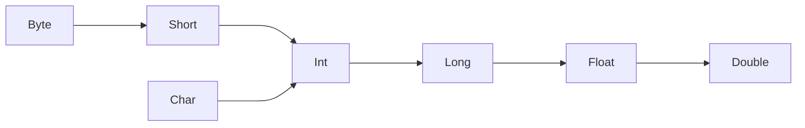

## Casting for Numeric Types

```mermaid
graph LR
    Byte ---> Short
    Short ---> Int
    Char ---> Int
    Int ---> Long
    Long ---> Float
    Float ---> Double
```

The casting are one way operation from the left to right.
